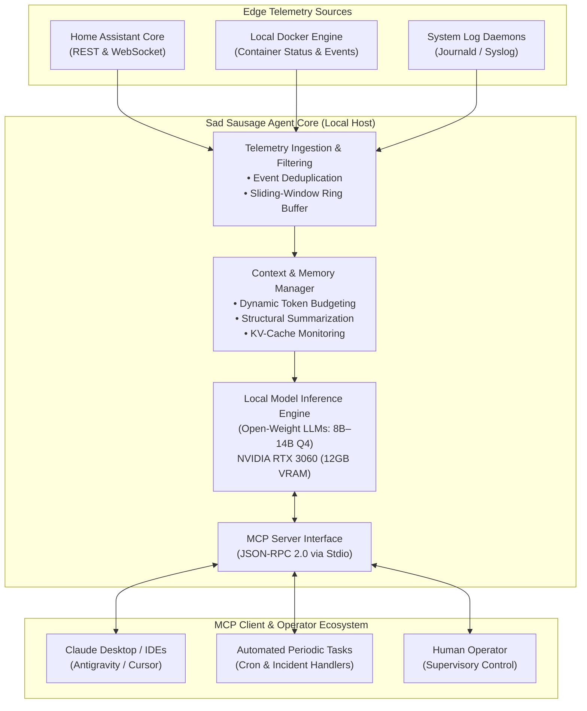

# System Architecture & Technical Specification – Sad Sausage (SS-Ops)

## 1. Architectural Overview

**Sad Sausage (SS-Ops)** is a deterministic, locally-hosted Edge AI Operations Agent designed for autonomous smart-home automation management, local container monitoring, and proactive infrastructure diagnostics.

The architecture prioritizes **privacy**, **zero external cloud dependencies**, and **reproducible deterministic execution**.



---

## 2. Component Specifications

### 2.1 Telemetry Ingestion Pipeline
The telemetry layer is responsible for continuous ingestion of real-world home automation and system events:
1. **Event Filtering & Deduplication:** Filters noisy, high-frequency IoT sensor updates (e.g., continuous power fluctuations < 0.5%) before context insertion.
2. **Sliding-Window Ring Buffer:** Preserves the last $N$ relevant state changes and service alerts in RAM rather than inflating GPU VRAM.
3. **Structured Normalization:** Converts vendor-specific device states (Zigbee, Z-Wave, MQTT) into uniform JSON schema representations.

### 2.2 Context & Memory Manager (The VRAM Constraint)
Edge deployments on 12GB VRAM face strict hardware boundaries:
* **Base Model Memory:** A 4-bit quantized 8B or 14B parameter model occupies between 5.5GB and 9.5GB of VRAM.
* **KV-Cache Allocation:** At an 8,192 token context window, the Key-Value (KV) cache demands approximately 1.5GB to 2.5GB of dedicated VRAM.
* **The Operational Bottleneck:** When parsing extensive multi-hour device traces (>2,000 log lines), token requirements surge past 16,000 tokens. On 12GB VRAM, this causes Out-Of-Memory (OOM) faults or aggressive context truncation, losing topological awareness of past network states.

```text
+-------------------------------------------------------------------+
| 12GB VRAM Budget Breakdown (14B Q4 Parameter Model)               |
+-------------------------------------------------------------------+
| [Model Weights: ~8.8 GB] | [KV-Cache 8k: ~1.8 GB] | [Free: ~1.4 GB]|  <-- Operational Limit
+-------------------------------------------------------------------+
| Multi-Hour Event Trace (16k-32k Tokens)                           |
| [Model Weights: ~8.8 GB] | [KV-Cache 32k: ~7.2 GB] ===> OOM CRASH |
+-------------------------------------------------------------------+
```

### 2.3 Model Context Protocol (MCP) Interface
The agent exposes a standard-compliant MCP server (`sad_sausage_mcp.py`) operating over bidirectional `stdio` streams using JSON-RPC 2.0:
* **Deterministic Tool Execution:** Tools provide non-destructive diagnostic reports and system specifications.
* **Strict Type Validation:** All incoming arguments are validated against standard JSON Schema definitions.
* **Zero Shell Execution:** MCP tool handlers execute strictly via in-memory Python routines without subshell invocations or arbitrary code execution.

---

## 3. Security by Design

Security is an architectural invariant rather than an afterthought:

1. **Principle of Least Privilege (PoLP):**
   - The MCP server runs with standard user permissions.
   - Diagnostic tools operate in read-only mode by default.
2. **Path Sanitization:**
   - Manifest and configuration file paths are validated and resolved against canonical base paths to prevent directory traversal (`../`).
3. **Phishing & Supply Chain Defense:**
   - External URLs (such as project sponsorship and repository links) are validated against strict regex patterns and verified against expected signatures in `validate_manifest.py`.
4. **Local Data Isolation:**
   - Telemetry data, network identifiers, and IoT entity IDs remain strictly within the local area network (LAN); no external telemetry is transmitted to third-party cloud APIs.

---

## 4. Hardware Evolution & Benchmarking Target

To graduate from reactive intervention to fully autonomous, long-horizon root-cause analysis (RCA), the platform follows an empirical benchmarking roadmap:

| Metric | Current State (Baseline) | Target State (Tier 2/3) | Evaluation Method |
| :--- | :--- | :--- | :--- |
| **Usable Context Window** | 8,192 tokens (12GB VRAM) | 32,768 – 65,536 tokens (24GB–48GB VRAM) | Needle-in-a-haystack log retrieval benchmark |
| **Model Capacity** | 8B – 14B Q4 quantized | 32B Q4 – 70B Q4 quantized | Multi-hop reasoning evaluation on IoT failure graphs |
| **Host System Memory** | 16 GB DDR3 (High swap) | 64 GB DDR5 (Zero swap) | Vector embedding latency over 100k syslog records |
| **Inference Throughput** | 18–25 tokens/second | 35–55 tokens/second | Continuous generation benchmark |
