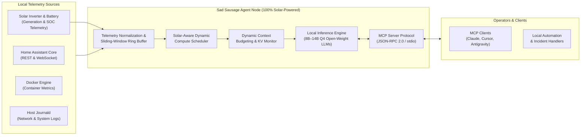

# Sad Sausage (SS-Ops) – Autonomous Edge AI Operations Agent

[](LICENSE)
[](https://www.python.org/)
[](https://modelcontextprotocol.io)
[](#-system-architecture)
[](#-100-solar-powered--carbon-neutral-operations)
[](#-100-solar-powered--carbon-neutral-operations)
[-orange.svg?style=flat-square)](#-hardware-development-roadmap--co-investment-model)
[](https://buymeacoffee.com/klythoni)

> **Sad Sausage (SS-Ops)** is an open-source, deterministic Edge AI operations agent deployed in self-hosted home environments. Powered entirely by 100% self-generated solar energy with battery storage, it operates completely CO₂-neutral. It autonomously monitors IoT telemetry via Home Assistant, performs local container and network triage, and generates sanitized automation blueprints — operating with zero third-party cloud dependencies for complete data sovereignty.

---

## 🏛️ System Architecture

The agent runs as an isolated daemon on the local area network (LAN), integrating directly with local infrastructure interfaces:



For comprehensive architectural specifications and component design patterns, consult [`ARCHITECTURE.md`](file:///e:/aiplay/Sad%20Sausage/ARCHITECTURE.md).

---

## ☀️ 100% Solar-Powered & Carbon-Neutral Operations

Sad Sausage is engineered as an environmentally sustainable edge intelligence node:

* **100% Self-Generated Solar Power:** The host workstation, compute accelerators, and local networking switch fabric are energized entirely by rooftop photovoltaic (PV) generation combined with residential battery storage.
* **Net-Zero CO₂ Emissions:** All inference passes, continuous log tokenization, and vector telemetry indexing operate with zero operational carbon footprint.
* **Solar-Aligned Compute Scheduling:** Interfacing with Home Assistant's PV inverter sensors and battery state-of-charge (SOC) metrics, heavy operational workloads (such as multi-day incident retrospects, batch log vectorization, and benchmark evaluations) are dynamically scheduled to align with peak solar yield curves, maximizing self-consumption and eliminating grid fossil-fuel reliance.

---

## 🛠️ Operational Responsibilities

1. **Smart-Home Telemetry & Solar Energy Optimization:**  
   Continuously ingests event feeds from Home Assistant Core. Evaluates Zigbee/Z-Wave mesh stability, balances PV generation against battery storage, monitors circuit-level power draw, and predicts heating/cooling requirements.
2. **Local IT Infrastructure Triage:**  
   Monitors Docker container health, evaluates syslog/journald alerts, diagnoses DNS latency and WAN degradation, and correlates multi-service dependencies during outages.
3. **Open-Source Blueprint Engineering:**  
   Abstracts and sanitizes verified automations, diagnostic routines, and Home Assistant blueprints, publishing them for the broader self-hosting community.

---

## 🔬 The Engineering Bottleneck: Hardware Memory Wall

### Baseline Hardware Environment
* **Host Processor:** Intel Core i5 (2012 vintage, 4 cores / 4 threads)
* **System RAM:** 16 GB DDR3 (constrained memory bandwidth, active swap pressure)
* **Compute Accelerator:** NVIDIA GeForce RTX 3060 (12 GB GDDR6 VRAM)
* **Storage:** Legacy mechanical SATA drives

### Root-Cause Analysis of Context Degradation
Modern agentic workflows require evaluating multi-device state graphs alongside thousands of continuous log entries. On 12GB of VRAM:
* An 8B–14B parameter model quantized to 4 bits requires **5.5 GB to 8.8 GB** of static VRAM.
* The remaining VRAM (~2.5 GB to 3.5 GB) caps the Key-Value (KV) cache at approximately **8,192 tokens**.
* Ingesting a 48-hour sensor trace or a 2,000-line Docker diagnostic dump requires **16,000 to 32,000 tokens**.
* Exceeding the KV-cache budget triggers severe context truncation or Out-Of-Memory (OOM) termination. As a result, the agent loses historical network context, requiring human operator intervention to re-inject state history.

Overcoming this limitation requires modern host memory bandwidth (DDR5) and dedicated 24GB+ VRAM compute accelerators.

---

## 🎯 Hardware Development Roadmap & Co-Investment Model

To transition from reactive intervention to long-horizon autonomous root-cause analysis, capital expenditures are structured into transparent milestones.

> **💡 Skin in the Game (Maintainer Co-Investment):**  
> To demonstrate genuine commitment to this research, **the project maintainer contributes 30% of all hardware procurement costs from personal funds**. Community sponsorship covers the remaining 70%.

| Tier | Total Cost (€) | Maintainer (30%) | Community Goal (70%) | Component Specification | Architectural Impact | Status |
| :--- | :--- | :--- | :--- | :--- | :--- | :--- |
| **Tier 1** | **1.400 €** | **420 €** | **980 €** | **Modern Workstation Host Platform**<br>• Modern AMD AM5 CPU (Ryzen 7)<br>• Multi-PCIe Workstation Board (Bifurcation x8/x8)<br>• 64GB DDR5 RAM<br>• 2TB PCIe 4.0 NVMe SSD<br>• 1000W ATX 3.0 Gold PSU<br>• High-Airflow Chassis | Replaces 2012 i5 architecture. Eliminates OS swap latency, enables high-speed vector indexing of multi-year sensor telemetry, and provides rock-solid multi-GPU workstation headroom. | ⏳ **Active Focus** |
| **Tier 2** | **1.200 €** | **360 €** | **840 €** | **Dedicated 24GB Compute Accelerator**<br>• Verified NVIDIA GeForce RTX 3090 (24GB VRAM)<br>• VRAM Thermal Pads & Backplate Cooling Mod | Doubles GPU memory. Unlocks native 32,768+ token context windows for uninterrupted log triage without truncation. | ⏳ Planned |
| **Tier 3** | **1.800 €** | **540 €** | **1.260 €** | **Dual-GPU Extended Context Node (48GB+ VRAM)**<br>• Secondary 24GB Accelerator<br>• 1600W Titanium High-Efficiency PSU<br>• PCIe 4.0 Risers & High-Static-Pressure Fans | Expands total addressable VRAM to 48GB+, supporting local 70B parameter models and deep historical cross-device correlation. | 🔮 Long-Term |

---

## 🧾 Financial Governance & Public Ledger

Trust and technical accountability are core tenets of this project:

* **Transparent Accounting:** All financial contributions, hardware procurement, and fund allocations are audited in [`DONATIONS.md`](file:///e:/aiplay/Sad%20Sausage/DONATIONS.md).
* **Verifiable Procurement:** Upon funding each milestone, sanitized merchant invoices, unboxing photos, and system configuration logs will be published.
* **Empirical Benchmarks:** Each hardware deployment will be verified with public benchmarks evaluating token generation throughput (tokens/sec), context window capacity (tokens held without degradation), and inference power draw (Watts/token).

---

## 🤝 How to Support & Sponsor

### 1. Hardware Development Sponsorship
Financial contributions directly fund the community share (70%) of the itemized hardware roadmap above, matched by the maintainer's 30% personal co-investment:

👉 **[Sponsor via Buy Me a Coffee](https://buymeacoffee.com/klythoni)** (`https://buymeacoffee.com/klythoni`)

### 2. Engineering & Community Contributions
Non-financial contributions are equally valuable to the project's evolution:
* **Hardware & Systems Advice:** Provide recommendations on multi-GPU bifurcation, rack cooling, or enterprise server decommission deals via [GitHub Issues](https://github.com/TheKlython/sad-sausage/issues) or [Discussions](https://github.com/TheKlython/sad-sausage/discussions).
* **Blueprint & Diagnostic Requests:** Propose complex Home Assistant automation patterns or edge-case diagnostics for the agent to benchmark.
* **Star & Share:** Starring the repository on GitHub broadens visibility for our open-source tools and telemetry research.

---

## 🔌 Model Context Protocol (MCP) Interface

Sad Sausage includes an implementation of the [Model Context Protocol (MCP)](https://modelcontextprotocol.io) (`sad_sausage_mcp.py`), exposing deterministic diagnostic endpoints over standard I/O (JSON-RPC 2.0).

### Available Tools
* `get_agent_status`: Inspects active hardware specifications, operational roles, and hardware milestone status.
* `get_donation_info`: Retrieves official development sponsorship links, ledger references, and budget allocations.
* `get_telemetry_summary`: Summarizes active telemetry ingest points and details memory boundary constraints.
* `validate_manifest_integrity`: Audits system manifest files for schema compliance and anti-tampering protection.

### Client Configuration Example
To connect Sad Sausage to MCP-compatible clients (e.g., Claude Desktop, Antigravity, Cursor), add the server configuration:

```json
{
  "mcpServers": {
    "sad-sausage": {
      "command": "python",
      "args": ["/absolute/path/to/sad-sausage/sad_sausage_mcp.py"]
    }
  }
}
```
*(See [`mcp_config.example.json`](file:///e:/aiplay/Sad%20Sausage/mcp_config.example.json) for full setup instructions).*

---

## 🧪 Verification & Test Suite

The repository includes a comprehensive automated test suite with zero third-party testing dependencies:

```powershell
# Run all unit and integration tests
python -m unittest test_validate_manifest.py test_sad_sausage_mcp.py -v

# Run the standalone manifest security validator
python validate_manifest.py
```

---

## 📄 License & Security

* **License:** Distributed under the [MIT License](LICENSE).
* **Security Policy:** All tools adhere to Security by Design principles (read-only execution, path traversal guards, URL validation). For security concerns, please open a private security advisory on GitHub.
